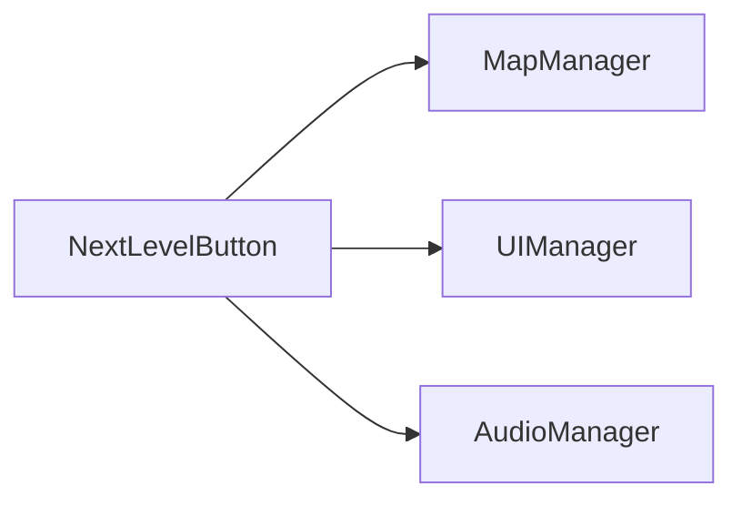
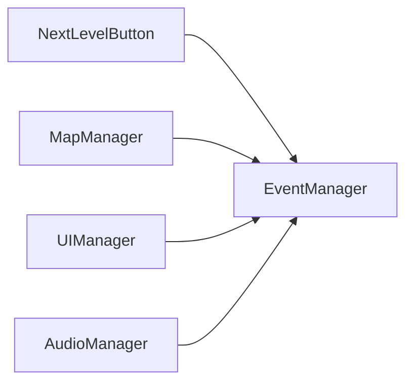

[TOC]

# 思考
## Settings系统中，设置按钮和系统总管理脚本之间的关系，按钮响应函数应该放哪，事件注册应该放哪
有SettingsManager.ts、SettingsButton节点(包含Button组件)，如果要实现点击SettingsButton后打开设置面板(SettingsPanel，跟SettingsButton同级)，有多种方式

**1.响应函数写在SettingsManager中，事件绑定通过SettingsButton上的Button组件可视化绑定**
* 优点：可视化操作，无需代码注册，操作少，直观
* 缺点：因为是可视化绑定的，所以移动SettingsButton节点或者SettingsManager改名会丢失绑定。又不内聚，又有耦合

**2.响应函数和注册都在SettingsManager中**
* 优点：代码集中，便于统一管理
* 缺点：不内聚，响应函数和注册都不在SettingsButton自身中，按钮和管理器耦合。无法可视化

**3.单独开一个SettingsButton脚本，响应函数和注册都在该脚本中**
* 优点：
 * 高内聚：所有的逻辑都在自身内部，职责单一，易于维护和复用
 * 解耦：按钮只负责自身被点击的逻辑，不关心别的组件如何响应，也不依赖别的组件
 * 可移植性：由于高内聚低耦合，SettingsButton节点或者脚本都能直接在其他项目中复用
 * 可视化友好：在有Button组件的节点中拖拽添加SettingsButton脚本就完成了
* 缺点：如果按钮行为非常简单，单开脚本就显得有冗余

## 事件系统
### 作用
事件系统可以提高代码内聚性、降低耦合性、降低维护成本
代码中经常会碰到A中某处需要调用B的函数的情况，并且这种情况是发生了某个事件这种能清晰表达的，不是单纯的调用，而是A和B的业务关系。比如点击某个按钮时进入下一关，可能需要加载下一关的地图、更新UI、背景音乐切换等。
一种可能的实现是，Player的die()函数中调用各个模块的函数，比如
```typescript
@ccclass('NextLevelButton')
export class NextLevelButton extends Component {
    @property(MapManager)
    mapManager: MapManager;
    
    @property(UIManager)
    uiManager: UIManager;
    
    @property(AudioManager)
    audioManager: AudioManager;

    onLoad() {
        this.node.on('click', () => {
            this.mapManager.nextLevel();
            this.uiManager.updateLevelUI();
            this.audioManager.updateLevelSound();
        });
    }
}
```
但是这样的话就产生了耦合，`NextLevelButton`依赖了其他三个类，可复用性不强。并且某个模块在进入下一关时要做什么，这是这个模块自身的一种属性，放在这个模块本身内部要更好，而这里都写在了`NextLevelButton`中
使用事件系统实现如下
```typescript
@ccclass('NextLevelButton')
export class NextLevelButton extends Component {
    onLoad() {
        this.node.on('click', () => {
            EventManager.emit(ENTER_NEXT_LEVEL);
        });
    }
}

@ccclass('MapManager')
export class MapManager {
    onLoad() {
        EventManager.on(ENTER_NEXT_LEVEL, this.nextLevel, this);
    }

    nextLevel() {
        //...
    }
};

@ccclass('UIManager')
export class UIManager {
    onLoad() {
        EventManager.on(ENTER_NEXT_LEVEL, this.nextLevel, this);
    }

    updateLevelUI() {
        // ...
    }
};

@ccclass('AudioManager')
export class AudioManager {
    onLoad() {
        EventManager.on(ENTER_NEXT_LEVEL, this.nextLevel, this);
    }

    updateLevelSound() {
        // ...
    }
};
```
这样就将

的依赖关系变为了

并且一个类只关注自身的逻辑，即内部各种函数实现和发送什么事件、监听什么事件，实现了模块化。不同模块间通过EventManager作为桥梁交互。

但是这样不是还依赖于`EventManager`吗，我换个项目没有`EventManager`了呢。

但实际上，引擎就已经实现了事件系统，如果都使用引擎提供的事件系统那就完全可复用，引擎的事件系统其实就相当于事件交互的标准。就好像不同的信号发射和接收设备使用同一频率，或电源的插头和插座使用相同的标准规格。

### 组织方法
Cocos有两种事件，一个是`director`提供的全局事件，一个是`node`提供的节点事件。

一般节点事件用于局部通信，比如兄弟节点间、父子节点间等，而全局事件用于跨系统、跨模块甚至全局广播的情况

**1.子节点通知父节点**
**子节点在父节点上emit，父节点监听**
```typescript
export class Child extends Component {
    onLoad() {
        this.node.on(Input.EventType.TOUCH_END, onClicked, this);
    }
    onDestroy() {
        this.node.off(Input.EventType.TOUCH_END, onClicked, this);
    }
    onClicked() {
        this.node.parent.emit('child-clicked');
    }
}

export class Parent extends Component {
    onLoad() {
        this.node.on("child-clicked", onChildClicked, this);
    }
    onDestroy() {
        this.node.off("child-clicked", onChildClicked, this);
    }
    onChildClicked() {
        console.log("child-clicked');
    }
}
```
**事件冒泡**
```typescript
export class Child extends Component {
    onLoad() {
        this.node.on(Input.EventType.TOUCH_END, onClicked, this);
    }
    onDestroy() {
        this.node.off(Input.EventType.TOUCH_END, onClicked, this);
    }

    onClicked() {
        const event = new Event.EventCustom('child-clicked', true); // true 表示冒泡
        this.node.dispatchEvent(event);
    }
}

export class Parent extends Component {
    onLoad() {
        this.node.on('child-bubble', this.onChildClicked, this);
    }
    onDestroy() {
        this.node.off('child-bubble', this.onChildClicked, this);
    }
    onChildBubble(event) {
        console.log('child-clicked');
    }
}
```

**兄弟节点间**
可以通过都在父节点上派发和监听事件实现
```typescript
class A extends Component {
    onLoad() {
        this.node.on(Input.EventType.TOUCH_END, onClicked, this);
    }
    onDestroy() {
        this.node.off(Input.EventType.TOUCH_END, onClicked, this);
    }
    onClicked() {
        this.node.parent.emit('A-clicked');
    }
}

class B extends Component {
    onLoad() {
        this.node.parent.on('A-clicked', onAClicked, this);
    }
    onDestroy() {
        this.node.parent.off('A-clicked', onAClicked, this);
    }
    onAClicked() {
        console.log("A-clicked");
    }
}
```
